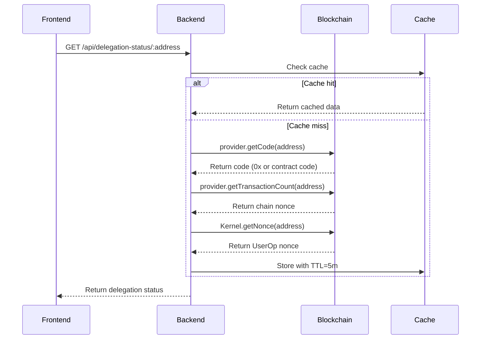

# Delegation Management Design

## Context
Delegation management handles EIP-7702 authorization flow, allowing EOAs to temporarily delegate their code to the Kernel contract. This is the onboarding mechanism for new users.

**Constraints**:
- Must be seamless (minimal user friction)
- Must handle edge cases (network issues, stale nonces)
- Must be secure (prevent authorization spoofing)
- Must be efficient (caching critical for performance)

## Goals / Non-Goals

**Goals**:
- First-time users can delegate in a single transaction
- Delegation status is efficiently queried and cached
- Authorization signatures are securely verified
- Support for revocation (though rare)

**Non-Goals**:
- Multi-chain delegation (single chain per deployment)
- Automatic re-delegation after revocation
- Complex authorization policies (time limits, etc.)

## Decisions

### Decision 1: Automatic Delegation Detection
**What**: Check on-chain code to determine delegation status; don't require separate API endpoint.

**Why**:
- Single source of truth (blockchain)
- No need to maintain separate database
- Simpler architecture
- Can be cached effectively

**Implementation**:
```javascript
const isDelegated = await provider.getCode(address) !== '0x';
```

### Decision 2: Authorization Included in Same Transaction
**What**: Include authorizationList in the same type 0x04 transaction as the UserOperation.

**Why**:
- Atomic execution (delegate and execute together)
- Single transaction cost
- Better UX (no waiting period)
- Matches EIP-7702 design intent

**Alternative**: Require separate delegation transaction first
- Rejected: Double transaction cost, worse UX

### Decision 3: Redis Caching for Delegation Status
**What**: Cache delegation status in Redis with configurable TTL.

**Why**:
- Reduces RPC calls (expensive and slow)
- Improves API response time
- Easy to invalidate on delegation changes
- Standard practice for Web3 backends

**Configuration**:
- TTL: 5 minutes (balance freshness vs. performance)
- Cache key: `delegation:${chainId}:${address}`
- Invalidation: Delete cache after successful delegation

### Decision 4: Backend Manages Authorization Validation
**What**: Backend verifies authorization signatures and includes them in transactions.

**Why**:
- Prevents malicious authorizations
- Centralized logic (not duplicated in frontend)
- Can add additional validation layers
- Better security posture

**Alternative**: Let frontend handle everything
- Rejected: Security risk, harder to control

## Technical Design

### API Endpoints

**GET /api/delegation-status/:address**
```typescript
Response: {
  delegated: boolean;
  eoaNonce: number;      // Chain nonce
  userOpNonce: number;   // UserOp nonce from Kernel
  kernelAddress: string;
  chainId: number;
}
```

**POST /api/execute** (includes authorization if needed)
```typescript
Request: {
  userOp: PackedUserOperation;
  authorization?: {  // Optional (only for first-time users)
    chainId: number;
    address: string;
    nonce: number;
    signature: string;
  }
}
```

### Delegation Detection Flow



### Authorization Message Construction

**EIP-7702 Authorization Format**:
```javascript
const authorization = {
  chainId: chainId,           // Current chain ID
  address: kernelAddress,     // Kernel contract address
  nonce: eoaNonce             // User's current chain nonce
};

// Hash for signing
const authHash = ethers.solidityPackedKeccak256(
  ['uint256', 'address', 'uint256'],
  [authorization.chainId, authorization.address, authorization.nonce]
);

// User signs with their EOA
const signature = await signer.signMessage(authHash);
```

### Transaction Building Logic

```javascript
async function buildTransaction(userOp, authorization, userAddress) {
  // 1. Check delegation status
  const code = await provider.getCode(userAddress);
  const needsAuth = code === '0x';

  // 2. Build type 0x04 transaction
  const tx = {
    type: 0x04,
    authorizationList: needsAuth ? [authorization] : [],
    to: ENTRYPOINT_ADDRESS,
    data: entryPointInterface.encodeFunctionData('handleOps', [
      [userOp],
      bundlerAddress
    ])
  };

  return tx;
}
```

### Caching Strategy

**Cache Key Structure**:
```
delegation:{chainId}:{address}
```

**Cache Value**:
```typescript
{
  delegated: boolean;
  eoaNonce: number;
  userOpNonce: number;
  timestamp: number;
  chainId: number;
}
```

**Cache Operations**:
- **GET**: Try cache → return if found and fresh
- **SET**: Store on-chain query result with TTL
- **DELETE**: Invalidate after delegation change
- **FALLBACK**: Direct on-chain query if Redis unavailable

**Invalidation Triggers**:
1. User successfully delegates (after UserOp execution)
2. User revokes delegation
3. Manual cache flush (admin operation)

### Signature Verification

**Authorization Signature Recovery**:
```javascript
function verifyAuthorization(authorization, expectedSigner) {
  // Reconstruct hash
  const hash = ethers.solidityPackedKeccak256(
    ['uint256', 'address', 'uint256'],
    [authorization.chainId, authorization.address, authorization.nonce]
  );

  // Recover signer from signature
  const signer = ethers.verifyMessage(hash, authorization.signature);

  // Verify signer matches
  return signer.toLowerCase() === expectedSigner.toLowerCase();
}
```

### Revocation Process

**Type 0x04 Revocation Transaction**:
```javascript
const revokeTx = {
  type: 0x04,
  authorizationList: [{
    chainId: chainId,
    address: '0x0000000000000000000000000000000000000000',  // Empty address
    nonce: eoaNonce,
    signature: signature
  }],
  to: userAddress,  // Send to self with no data
  data: '0x'
};
```

## Security Considerations

### Authorization Security

**Replay Attack Prevention**:
- Use user's current chain nonce (incremented after each transaction)
- Validate nonce matches on-chain state
- Reject stale authorizations

**Signature Spoofing Prevention**:
- Full ECDSA signature recovery
- Verify signer matches expected EOA address
- Reject invalid signatures before building transaction

**Front-running Protection**:
- Include authorization in same transaction (atomic)
- No separate authorization transaction to front-run
- Bundler sends transaction directly

### Cache Security

**Stale Data Prevention**:
- Short TTL (5 minutes)
- Invalidate on delegation changes
- Fallback to on-chain query if uncertain

**Cache Poisoning Prevention**:
- Validate cache data structure
- Use Redis with authentication
- Log and alert on cache errors

### API Security

**Rate Limiting**:
- Implement rate limiting on delegation status endpoint
- Prevent abuse that could exhaust RPC quotas

**Input Validation**:
- Validate Ethereum address format
- Validate signature format (65 bytes)
- Validate nonce is non-negative

## Risks / Trade-offs

### Risk 1: Stale Authorization Nonce
**Impact**: High (authorization fails)
**Mitigation**:
- Always fetch fresh nonce before requesting signature
- Implement nonce refresh mechanism in frontend
- Clear user feedback on failure

### Risk 2: Cache Inconsistency
**Impact**: Medium (wrong delegation status)
**Mitigation**:
- Short TTL minimizes window
- Invalidate on known delegation changes
- Log inconsistencies for monitoring

### Risk 3: RPC Provider Issues
**Impact**: High (cannot check delegation status)
**Mitigation**:
- Use multiple RPC providers with failover
- Implement retry logic with exponential backoff
- Cache aggressively to reduce dependency

### Trade-off 1: Caching vs. Freshness
**Decision**: Cache with 5-minute TTL
**Rationale**: Freshness not critical (delegation is rare event)
**Impact**: Small delay in detecting delegation, but much better performance

### Trade-off 2: Single Transaction vs. Two Transactions
**Decision**: Single transaction (authorization + execution)
**Rationale**: Better UX, atomic, cheaper
**Impact**: Complex authorization logic, but justified by benefits

## Migration Plan

**Initial Deployment**:
1. Deploy Redis instance (or use managed service)
2. Configure caching parameters (TTL, max size)
3. Deploy API endpoints with caching enabled
4. Monitor cache hit/miss ratio

**Cache Invalidation Strategy**:
- After successful UserOp: Invalidate cache if status changed
- After revocation: Invalidate cache immediately
- Manual: Admin endpoint to flush cache for specific address

**Future Enhancements**:
- Implement cache warming for frequent users
- Add metrics for cache performance
- Consider CDN edge caching for delegation status

## Open Questions

1. **What TTL for delegation cache?**
   - Currently: 5 minutes
   - Consider: 1-10 minutes range
   - Decision: Start with 5m, adjust based on metrics

2. **Should we cache UserOp nonces?**
   - Pros: Faster nonce queries
   - Cons: More complex invalidation
   - Decision: Start without, add if performance issues

3. **How to handle concurrent authorization requests?**
   - Currently: Process in order
   - Consider: Lock mechanism to prevent race conditions
   - Decision: Implement Redis lock for same address

4. **Should we implement authorization expiry?**
   - Currently: No expiry (permanent until revoked)
   - Consider: Time-limited authorizations
   - Decision: Skip for MVP (adds complexity)
