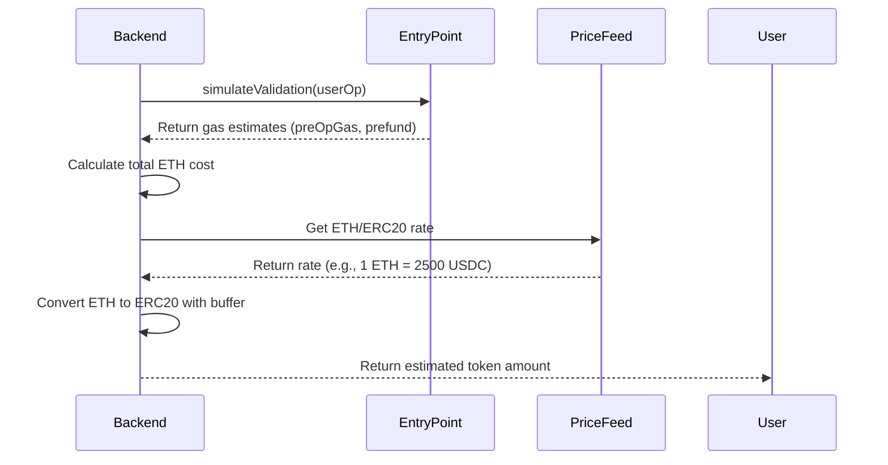

# Payment Processing Design

## Context
Payment processing enables users to pay gas fees with ERC20 tokens (USDC, USDT) instead of requiring ETH. This is critical for user onboarding and cost optimization.

**Constraints**:
- Gas estimation must be accurate (overpayment is wasteful, underpayment fails)
- Exchange rates are volatile (need frequent updates)
- Token approvals add friction (minimize user actions)
- Bundler must be reliably compensated (business viability)

## Goals / Non-Goals

**Goals**:
- Accurate gas estimation with minimal overpayment
- Seamless ERC20 payment experience
- Support multiple tokens (USDC, USDT initially)
- Clear error messages and recovery guidance

**Non-Goals**:
- Dynamic gas bidding (use standard gas oracle)
- Cross-chain token payments
- Complex token swap integrations (DEX aggregation)
- Multiple payment methods per transaction

## Decisions

### Decision 1: Gas Estimation via EntryPoint.simulateValidation
**What**: Use EntryPoint's simulateValidation method to estimate gas cost.

**Why**:
- Most accurate estimation (simulates actual execution)
- Standard AA pattern (well-tested)
- Returns precise gas amounts for each phase
- No need to maintain custom estimation logic

**Implementation**:
```javascript
const { returnInfo } = await entryPoint.simulateValidation(userOp);
const gasCost = returnInfo.preOpGas + returnInfo.prefund;
```

### Decision 2: Exchange Rate from Uniswap V3 Pools
**What**: Fetch ETH/ERC20 rates from Uniswap V3 pools (or similar DEX).

**Why**:
- On-chain data (no API dependency)
- Real-time rates (always current)
- No API rate limits or failures
- Decentralized and censorship-resistant

**Alternative**: Use CoinGecko/Coingecko APIs
- Rejected: API dependencies, rate limits, potential outages

### Decision 3: Safety Buffer for Gas Price Volatility
**What**: Add 10-20% buffer to estimated gas amount.

**Why**:
- Gas prices can change rapidly between estimation and execution
- Prevents transaction failures due to underpayment
- Small overpayment is acceptable (better than failure)
- User experience priority (reliability over optimization)

**Configuration**:
```javascript
const buffer = 0.15; // 15% buffer
const estimatedCost = actualCost * (1 + buffer);
```

### Decision 4: Infinite Token Approval for UX
**What**: Request unlimited approval (type(uint256).max) instead of exact amount.

**Why**:
- One-time approval for all future transactions
- Better user experience (no repeated approvals)
- Negligible security risk (Kernel contract is audited)
- Industry standard (similar to other AA solutions)

**Alternative**: Per-transaction approval
- Rejected: Terrible UX, user must approve every transaction

### Decision 5: paymasterAndData Encoding Format
**What**: Encode as `abi.encode([tokenAddress, amount])`.

**Why**:
- Simple and standard ABI encoding
- Easy to decode in Solidity contract
- Extensible (can add more fields later)
- Matches common paymaster patterns

**Solidity Decoding**:
```solidity
(address token, uint256 amount) = abi.decode(
    userOp.paymasterAndData,
    (address, uint256)
);
```

## Technical Design

### Gas Estimation Flow



### Exchange Rate Fetching

**Uniswap V3 Pool Query**:
```javascript
async function getEthTokenPrice(tokenAddress, chainId) {
    // Find pool address for ETH/Token pair
    const poolAddress = await findPool(tokenAddress, WETH_ADDRESS, chainId);

    // Query pool state
    const pool = new ethers.Contract(poolAddress, POOL_ABI, provider);
    const slot0 = await pool.slot0(); // sqrtPriceX96
    const liquidity = await pool.liquidity();

    // Calculate price from sqrtPriceX96
    const price = calculatePrice(slot0.sqrtPriceX96, tokenDecimals);

    return price; // ETH per 1 Token
}
```

**Price Caching**:
```javascript
const priceCache = new Map();

async function getCachedPrice(tokenAddress) {
    const cacheKey = `${tokenAddress}_${Date.now()}`;

    // Check cache (30s TTL)
    if (priceCache.has(cacheKey)) {
        return priceCache.get(cacheKey);
    }

    // Fetch fresh price
    const price = await getEthTokenPrice(tokenAddress, chainId);

    // Cache for 30 seconds
    priceCache.set(cacheKey, price);
    setTimeout(() => priceCache.delete(cacheKey), 30000);

    return price;
}
```

### Gas Estimation Calculation

```javascript
async function estimateGasPayment(userOp, tokenAddress) {
    // 1. Simulate validation
    const { returnInfo } = await entryPoint.simulateValidation(userOp);

    // 2. Calculate ETH cost
    const ethCost = (returnInfo.preOpGas + returnInfo.prefund) *
                   userOp.maxFeePerGas;

    // 3. Get exchange rate
    const ethPerToken = await getCachedPrice(tokenAddress);

    // 4. Convert to token amount
    const tokenAmount = ethCost / ethPerToken;

    // 5. Apply safety buffer (15%)
    const bufferedAmount = tokenAmount * 1.15;

    // 6. Convert to token units (considering decimals)
    const tokenUnits = ethers.parseUnits(
        bufferedAmount.toFixed(6),
        await getTokenDecimals(tokenAddress)
    );

    return tokenUnits;
}
```

### paymasterAndData Encoding

```javascript
function encodePaymentData(tokenAddress, amount) {
    // Encode as [address, uint256]
    const encoded = ethers.AbiCoder.defaultAbiCoder().encode(
        ['address', 'uint256'],
        [tokenAddress, amount]
    );

    return encoded;
}

// Usage
const userOp = {
    // ... other fields
    paymasterAndData: encodePaymentData(USDC_ADDRESS, amountInWei)
};
```

### Balance and Allowance Validation

```javascript
async function validatePayment(userAddress, tokenAddress, amount) {
    const token = new ethers.Contract(tokenAddress, ERC20_ABI, provider);

    // Check balance
    const balance = await token.balanceOf(userAddress);
    if (balance < amount) {
        throw new Error(
            `Insufficient balance. Required: ${formatToken(amount)}, ` +
            `Current: ${formatToken(balance)}`
        );
    }

    // Check allowance
    const allowance = await token.allowance(userAddress, KERNEL_ADDRESS);
    if (allowance < amount) {
        throw new Error(
            'Please approve token spending for Kernel contract'
        );
    }

    return true;
}
```

### Token Approval Flow

```javascript
async function approveToken(tokenAddress, amount) {
    const token = new ethers.Contract(tokenAddress, ERC20_ABI, signer);

    // Approve unlimited amount (better UX)
    const tx = await token.approve(
        KERNEL_ADDRESS,
        ethers.MaxUint256
    );

    await tx.wait();
    return tx.hash;
}

// Alternatively, include approval in batch transaction
const batchCalls = [
    {
        target: tokenAddress,
        data: tokenInterface.encodeFunctionData('approve', [
            KERNEL_ADDRESS,
            ethers.MaxUint256
        ])
    },
    {
        target: targetContract,
        data: actualOperationData
    }
];
```

### Bundler Reimbursement Tracking

```javascript
const bundlerBalances = new Map();

async function trackReimbursement(tokenAddress, amount) {
    const currentBalance = bundlerBalances.get(tokenAddress) || 0;
    bundlerBalances.set(tokenAddress, currentBalance + amount);

    // Alert if balance reaches threshold
    if (currentBalance + amount >= BALANCE_THRESHOLD) {
        await alertHighBalance(tokenAddress, currentBalance + amount);
    }
}

async function swapTokensToEth(tokenAddress, amount) {
    // Use Uniswap or other DEX to swap accumulated tokens to ETH
    // This ensures Bundler always has ETH to pay gas
    const swapTx = await uniswapRouter.swapExactTokensForETH(
        amount,
        minEthOutput,
        [tokenAddress, WETH_ADDRESS],
        bundlerAddress,
        deadline
    );

    return swapTx;
}
```

### Error Handling

```javascript
class PaymentError extends Error {
    constructor(type, message, details) {
        super(message);
        this.type = type; // 'insufficient_balance', 'missing_approval', 'transfer_failed'
        this.details = details;
    }
}

async function handlePayment(error, context) {
    if (error.message.includes('insufficient balance')) {
        throw new PaymentError('insufficient_balance',
            error.message,
            {
                required: context.requiredAmount,
                current: context.currentBalance,
                token: context.tokenAddress
            }
        );
    }

    if (error.message.includes('allowance')) {
        throw new PaymentError('missing_approval',
            'Please approve token spending for Kernel contract',
            {
                token: context.tokenAddress,
                spender: context.kernelAddress
            }
        );
    }

    throw error;
}
```

## Security Considerations

### Gas Estimation Security

**Overestimation Prevention**:
- Use accurate EntryPoint simulation
- Apply reasonable buffer (not excessive)
- Monitor average overpayment rates

**Underpayment Prevention**:
- Conservative buffer (15-20%)
- Update exchange rate frequently (30s cache)
- Use high maxFeePerGas for estimation

### Token Approval Security

**Approval Limits**:
- Use infinite approval only for audited contracts
- Consider approval limits for less trusted contracts
- Document approval risks to users

**Approval Revocation**:
- Support revocation by setting allowance to 0
- Provide clear UI for revoking approvals
- Monitor for unusual approval patterns

### Exchange Rate Security

**Price Manipulation Prevention**:
- Use multiple liquidity sources (if available)
- Check for flash loan attacks (price deviation)
- Implement price sanity checks

**Fallback Mechanisms**:
- Secondary price source if primary fails
- Last known good rate with warning
- Manual override for emergency situations

## Risks / Trade-offs

### Risk 1: Gas Price Spike During Execution
**Impact**: Medium (transaction may fail)
**Mitigation**:
- Use conservative maxFeePerGas
- Monitor gas price before execution
- Implement retry with higher gas price

### Risk 2: Exchange Rate Volatility
**Impact**: Medium (user overpays or underpays)
**Mitigation**:
- Short cache TTL (30 seconds)
- Frequent price updates
- Buffer to account for volatility

### Risk 3: Token Approval Abuse
**Impact**: High (user tokens could be drained)
**Mitigation**:
- Kernel contract must be fully audited
- Clear communication to users
- Consider approval limits for additional safety

### Trade-off 1: Buffer Size vs. Overpayment
**Decision**: 15% buffer
**Rationale**: Balances reliability with cost efficiency
**Impact**: Small overpayment in exchange for higher success rate

### Trade-off 2: Infinite Approval vs. Per-Transaction Approval
**Decision**: Infinite approval for better UX
**Rationale**: Kernel contract is trusted and audited
**Impact**: Better UX with acceptable security trade-off

## Migration Plan

**Initial Deployment**:
1. Configure price feed sources (Uniswap pools)
2. Set up price caching mechanism
3. Implement gas estimation logic
4. Configure buffer percentage and cache TTL

**Token Support**:
- Start with USDC (most popular)
- Add USDT soon after
- Add other stablecoins based on demand

**Monitoring**:
- Track average overpayment percentage
- Monitor gas estimation accuracy
- Alert on price feed failures
- Track Bundler token balances

**Future Enhancements**:
- DEX aggregation for better prices
- Dynamic buffer based on volatility
- Multiple payment tokens per transaction
- Token swap optimization

## Open Questions

1. **What buffer percentage for gas estimation?**
   - Currently: 15%
   - Consider: 10-20% range based on chain
   - Decision: Start with 15%, adjust based on metrics

2. **Which price feeds to use?**
   - Currently: Uniswap V3 pools
   - Consider: Chainlink Oracles, DEX aggregators
   - Decision: Uniswap V3 initially, add Chainlink if needed

3. **Should we implement spending limits?**
   - Currently: No (infinite approval)
   - Consider: Per-transaction or daily limits
   - Decision: Skip for MVP, consider as safety feature

4. **How to handle token balance monitoring?**
   - Currently: Manual checks before each transaction
   - Consider: WebSocket subscriptions for real-time updates
   - Decision: Manual checks sufficient for MVP

5. **Should we support partial payment (gas sponsorship)?**
   - Currently: No (full user payment)
   - Consider: Paymaster sponsorship model
   - Decision: Not in scope for MVP
