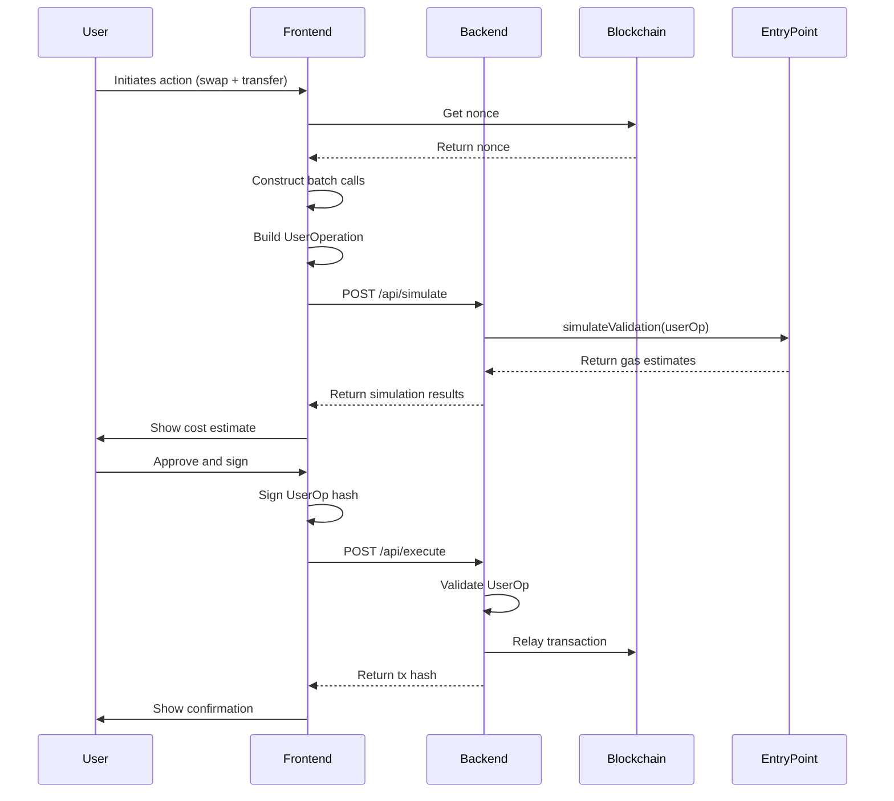

# User Operation Design

## Context
UserOperation management is the core of the account abstraction system, handling construction, signing, and lifecycle management of ERC-4337 UserOperations. This is the interface between user intent and blockchain execution.

**Constraints**:
- Must comply with ERC-4337 PackedUserOperation format
- Must handle batch operations efficiently
- Must provide clear error messages for users
- Must be secure (signature validation, replay protection)

## Goals / Non-Goals

**Goals**:
- Seamless UserOperation construction (frontend-friendly)
- Accurate gas estimation (prevent failures)
- Comprehensive error handling and recovery
- Support for batch operations
- Real-time status updates for UI

**Non-Goals**:
- Complex gas optimization strategies (use standard estimation)
- Custom encoding formats (use standard ERC-4337)
- Off-chain UserOperation execution
- Cross-chain UserOperations

## Decisions

### Decision 1: Frontend-First UserOp Construction
**What**: Frontend constructs UserOperation, backend only validates and relays.

**Why**:
- Frontend knows user intent best
- Backend doesn't need to understand operation details
- Faster iteration (no backend changes for new operations)
- Standard pattern in AA solutions

**Alternative**: Backend constructs UserOperation
- Rejected: Too complex, inflexible, bottleneck

### Decision 2: Standard ERC-4337 Encoding
**What**: Use exact PackedUserOperation structure per ERC-4337 spec.

**Why**:
- Standard ensures compatibility with EntryPoint
- Well-tested and audited format
- Works with existing tooling (ethers.js, viem)
- No need for custom encoding/decoding

**Implementation**:
```javascript
const PackedUserOperation = [
    sender,           // address
    nonce,            // uint256
    initCode,         // bytes
    callData,         // bytes
    accountGasLimits, // uint192
    preVerificationGas, // uint64
    gasFees,          // uint128
    paymasterAndData, // bytes
    signature         // bytes
];
```

### Decision 3: executeBatch for Multiple Operations
**What**: Single UserOperation with executeBatch containing multiple calls.

**Why**:
- Atomic execution (all or nothing)
- Lower gas (single validation, multiple executions)
- Simpler UX (one signature for multiple actions)
- Better performance (single transaction)

**Alternative**: Multiple UserOperations
- Rejected: Higher gas cost, non-atomic, worse UX

### Decision 4: Backend Nonce Locking for Concurrency
**What**: Use Redis locks to prevent nonce conflicts for concurrent requests.

**Why**:
- Prevents race conditions (two UserOps with same nonce)
- Simple and reliable
- Short-lived locks (transaction time)
- Standard pattern in distributed systems

**Implementation**:
```javascript
const lockKey = `nonce:${userAddress}`;
const lock = await redis.acquire(lockKey, { ttl: 30000 }); // 30s

try {
    // Process UserOperation
    await processUserOperation(userOp);
} finally {
    await redis.release(lock);
}
```

### Decision 5: Simulation Before Submission
**What**: Always simulate UserOperation before actual submission.

**Why**:
- Catches errors early (saves gas)
- Provides accurate gas estimates
- Validates operation logic
- Better UX (users see errors before spending)

**Cost**: One extra RPC call per UserOperation
- Justified: Saves more gas in prevented failures

## Technical Design

### UserOperation Construction Flow



### UserOperation Structure

```typescript
interface PackedUserOperation {
    sender: string;                    // User's EOA address
    nonce: bigint;                    // UserOp nonce from Kernel
    initCode: string;                 // Always "0x" (already delegated)
    callData: string;                 // Encoded executeBatch calls
    accountGasLimits: string;         // Packed [callGasLimit, verificationGasLimit]
    preVerificationGas: string;       // Pre-verification overhead
    gasFees: string;                 // Packed [maxPriorityFeePerGas, maxFeePerGas]
    paymasterAndData: string;        // Encoded [tokenAddress, amount]
    signature: string;                // User's ECDSA signature
}

interface Call {
    target: string;    // Contract address
    value: bigint;    // ETH value to send
    data: string;     // Encoded function call
}
```

### CallData Encoding

```javascript
import { ethers } from 'ethers';

// ABI for Kernel contract
const KERNEL_ABI = [
    "function executeBatch((address target, uint256 value, bytes data)[] calldata calls) external"
];

const kernelInterface = new ethers.Interface(KERNEL_ABI);

// Encode batch operations
function encodeBatchCalls(calls: Call[]): string {
    return kernelInterface.encodeFunctionData('executeBatch', [calls]);
}

// Example usage
const calls = [
    {
        target: DEX_ADDRESS,
        value: 0n,
        data: tokenInterface.encodeFunctionData('swap', [USDC_ADDRESS, ETH_ADDRESS, amount])
    },
    {
        target: TOKEN_ADDRESS,
        value: 0n,
        data: tokenInterface.encodeFunctionData('transfer', [recipientAddress, amount])
    }
];

const callData = encodeBatchCalls(calls);
```

### UserOp Hash Generation

```javascript
// ERC-4337 UserOp hash specification
function getUserOpHash(userOp, entryPointAddress, chainId) {
    const userOpType = [
        "address sender",
        "uint256 nonce",
        "bytes initCode",
        "bytes callData",
        "uint192 accountGasLimits",
        "uint64 preVerificationGas",
        "uint128 gasFees",
        "bytes paymasterAndData",
        "bytes signature"
    ];

    // Encode UserOp
    const encoded = ethers.AbiCoder.defaultAbiCoder().encode(
        userOpType,
        [
            userOp.sender,
            userOp.nonce,
            userOp.initCode,
            userOp.callData,
            userOp.accountGasLimits,
            userOp.preVerificationGas,
            userOp.gasFees,
            userOp.paymasterAndData,
            userOp.signature
        ]
    );

    // Hash with EntryPoint address and chainId
    const hash = ethers.keccak256(
        ethers.AbiCoder.defaultAbiCoder().encode(
            ["bytes32", "address", "uint256"],
            [ethers.keccak256(encoded), entryPointAddress, chainId]
        )
    );

    return hash;
}
```

### Gas Parameter Calculation

```javascript
async function estimateGasParameters(userOp, provider) {
    // Get current gas price (EIP-1559)
    const feeData = await provider.getFeeData();
    const baseFeePerGas = feeData.lastBaseFeePerGas || 3000000000n; // 3 gwei default
    const maxPriorityFeePerGas = feeData.maxPriorityFeePerGas || 2000000000n; // 2 gwei

    // Calculate maxFeePerGas (base + priority + 10% buffer)
    const maxFeePerGas = (baseFeePerGas + maxPriorityFeePerGas) * 11n / 10n;

    // Estimate gas limits via simulation
    const { returnInfo } = await entryPoint.simulateValidation(userOp);

    const callGasLimit = returnInfo.preOpGas + 50000n; // Add 50k buffer
    const verificationGasLimit = returnInfo.prefund / maxFeePerGas + 50000n;
    const preVerificationGas = 50000n; // Fixed overhead

    // Pack gas limits and fees
    const accountGasLimits = ethers.AbiCoder.defaultAbiCoder().encode(
        ["uint48", "uint48"],
        [callGasLimit, verificationGasLimit]
    );

    const gasFees = ethers.AbiCoder.defaultAbiCoder().encode(
        ["uint64", "uint64"],
        [maxPriorityFeePerGas, maxFeePerGas]
    );

    return {
        accountGasLimits,
        preVerificationGas,
        gasFees,
        callGasLimit,
        verificationGasLimit,
        maxFeePerGas,
        maxPriorityFeePerGas
    };
}
```

### Nonce Management

```javascript
// Fetch current nonce from Kernel
async function getCurrentNonce(userAddress, kernelContract) {
    const nonce = await kernelContract.getNonce(userAddress);
    return nonce;
}

// Lock-based nonce management for concurrency
async function getNextNonce(userAddress, kernelContract, redis) {
    const lockKey = `nonce:${userAddress}`;

    // Acquire lock (30s timeout)
    const lock = await redis.acquire(lockKey, { ttl: 30000 });

    try {
        // Fetch fresh nonce
        const currentNonce = await getCurrentNonce(userAddress, kernelContract);

        // Return next nonce (will be set on-chain after UserOp execution)
        return currentNonce;
    } finally {
        await redis.release(lock);
    }
}

// Handle nonce conflict (retry logic)
async function handleNonceConflict(userOp, retryCount, maxRetries) {
    if (retryCount >= maxRetries) {
        throw new Error('Max retries reached for nonce conflict');
    }

    // Fetch fresh nonce
    const freshNonce = await getCurrentNonce(userOp.sender, kernelContract);

    // Rebuild UserOp with fresh nonce
    const updatedUserOp = {
        ...userOp,
        nonce: freshNonce,
        signature: '' // Need to re-sign
    };

    return updatedUserOp;
}
```

### Batch Operation Validation

```javascript
async function validateBatchOperations(calls, provider) {
    const errors = [];

    for (let i = 0; i < calls.length; i++) {
        const call = calls[i];

        try {
            // Validate target address has code
            const code = await provider.getCode(call.target);
            if (code === '0x') {
                errors.push(`Operation ${i}: Target address has no code`);
                continue;
            }

            // Validate callData encoding
            try {
                // Try to decode to check if it's valid
                const decoded = decodeCallData(call.target, call.data);
                // Add specific validations based on function call
                if (decoded.name === 'transfer') {
                    await validateTokenTransfer(call.target, decoded.args);
                } else if (decoded.name === 'swap') {
                    await validateTokenSwap(call.target, decoded.args);
                }
            } catch (e) {
                errors.push(`Operation ${i}: Invalid callData encoding - ${e.message}`);
            }
        } catch (e) {
            errors.push(`Operation ${i}: Validation error - ${e.message}`);
        }
    }

    if (errors.length > 0) {
        throw new BatchValidationError(errors);
    }

    return true;
}
```

### UserOperation Lifecycle Management

```typescript
enum UserOpStatus {
    PENDING = 'pending',           // Constructed, not submitted
    SIMULATING = 'simulating',     // Simulating for validation
    READY = 'ready',               // Simulated successfully
    SIGNING = 'signing',           // Waiting for user signature
    SIGNED = 'signed',             // Signed, ready to submit
    SUBMITTED = 'submitted',         // Sent to backend
    RELAYED = 'relayed',           // Bundler sent transaction
    CONFIRMING = 'confirming',     // Waiting for block confirmation
    CONFIRMED = 'confirmed',       // Transaction mined
    FAILED = 'failed'               // Error occurred
}

interface UserOpLifecycle {
    userOpHash: string;
    status: UserOpStatus;
    createdAt: number;
    updatedAt: number;
    transactionHash?: string;
    error?: string;
}
```

### Error Categorization and Recovery

```javascript
class UserOpError extends Error {
    constructor(type, message, retriable, details) {
        super(message);
        this.type = type;
        this.retriable = retriable;
        this.details = details;
    }
}

function categorizeError(error) {
    // Nonce conflicts - retriable
    if (error.message.includes('nonce')) {
        return new UserOpError(
            'nonce_conflict',
            'Nonce conflict detected. Retrying with fresh nonce.',
            true,
            { suggestedAction: 'auto_retry' }
        );
    }

    // Insufficient gas - retriable with higher gas
    if (error.message.includes('gas required exceeds allowance')) {
        return new UserOpError(
            'insufficient_gas',
            'Gas limit too low. Increasing and retrying.',
            true,
            { suggestedAction: 'increase_gas' }
        );

    }

    // Network congestion - retriable with higher fee
    if (error.message.includes('replacement fee too low')) {
        return new UserOpError(
            'network_congestion',
            'Network congested. Increasing fee and retrying.',
            true,
            { suggestedAction: 'increase_fee' }
        );
    }

    // Insufficient balance - not retriable
    if (error.message.includes('insufficient balance')) {
        return new UserOpError(
            'insufficient_balance',
            'Insufficient token balance. Please add funds.',
            false,
            { suggestedAction: 'add_funds' }
        );
    }

    // Contract revert - not retriable
    if (error.message.includes('execution reverted')) {
        return new UserOpError(
            'contract_revert',
            'Operation would fail on-chain. Check callData.',
            false,
            { suggestedAction: 'check_operations' }
        );
    }

    // Unknown error - cautious retriable
    return new UserOpError(
        'unknown',
        error.message,
        true,
        { suggestedAction: 'manual_review' }
    );
}

// Retry logic
async function retryUserOperation(userOp, error, retryCount, maxRetries = 3) {
    if (retryCount >= maxRetries) {
        throw new Error('Max retries reached');
    }

    const categorized = categorizeError(error);

    if (!categorized.retriable) {
        throw categorized;
    }

    // Apply recovery strategy
    switch (categorized.details.suggestedAction) {
        case 'auto_retry':
            const freshNonce = await getCurrentNonce(userOp.sender, kernelContract);
            userOp.nonce = freshNonce;
            break;

        case 'increase_gas':
            userOp.accountGasLimits = increaseGasLimit(userOp.accountGasLimits, 1.2);
            break;

        case 'increase_fee':
            userOp.gasFees = increaseGasFee(userOp.gasFees, 1.1);
            break;
    }

    return userOp;
}
```

## Security Considerations

### Signature Security

**Replay Attack Prevention**:
- Unique UserOp hash per operation
- Nonce increments after each successful execution
- Chain ID included in hash (cross-chain replay prevention)

**Signature Forgery Prevention**:
- Full ECDSA signature recovery
- Verify signer matches sender
- Reject invalid signatures before submission

### CallData Security

**Malicious CallData Prevention**:
- Validate target addresses
- Check callData encoding
- Simulate before submission
- Reject known malicious patterns

**Batch Operation Security**:
- Validate each operation individually
- Check permissions (e.g., NFT ownership)
- Validate token balances before transfers

### Nonce Security

**Nonce Gaps**:
- Detect nonce gaps (indicating missed operations)
- Handle gracefully (don't fail entire system)
- Log for monitoring

**Nonce Conflicts**:
- Use locking mechanism (Redis)
- Implement retry logic
- Frontend should retry with fresh nonce

## Risks / Trade-offs

### Risk 1: Gas Estimation Inaccuracy
**Impact**: Medium (transaction fails or overpays)
**Mitigation**:
- Use EntryPoint.simulateValidation (most accurate)
- Add safety buffer (10-20%)
- Monitor average overpayment rate

### Risk 2: Nonce Conflicts in High Concurrency
**Impact**: Medium (some UserOps fail)
**Mitigation**:
- Redis locking mechanism
- Automatic retry with fresh nonce
- Frontend retry logic

### Risk 3: Frontend-Side Construction Complexity
**Impact**: Medium (UX issues, bugs)
**Mitigation**:
- Provide helper libraries
- Comprehensive documentation
- Error examples and guidance

### Trade-off 1: Frontend vs. Backend Construction
**Decision**: Frontend constructs UserOp
**Rationale**: Flexibility, speed, no bottleneck
**Impact**: Frontend complexity, but justified by benefits

### Trade-off 2: Simulation Overhead
**Decision**: Always simulate before submission
**Rationale**: Catches errors early, saves gas
**Impact**: Extra RPC call, but net positive (prevents failed transactions)

## Migration Plan

**Initial Deployment**:
1. Implement UserOperation construction library
2. Add signature generation utilities
3. Implement simulation endpoint
4. Add nonce management with locking
5. Implement error categorization and retry logic

**Frontend Integration**:
1. Install UserOp helper library
2. Implement batch operation UI
3. Add signing flow (wallet connection)
4. Implement status polling
5. Add error display and recovery UI

**Monitoring**:
- Track UserOperation success rate
- Monitor average gas estimation accuracy
- Track nonce conflict frequency
- Monitor retry success rate

**Future Enhancements**:
- UserOperation template library (common patterns)
- Gas optimization strategies
- Advanced batch operation validation
- Cross-chain support (if needed)

## Open Questions

1. **What gas limit buffer percentage?**
   - Currently: 10-20% dynamic
   - Consider: Fixed 15% for simplicity
   - Decision: Start with 15%, adjust based on metrics

2. **Should we implement pre-signed UserOp templates?**
   - Currently: No (construct fresh each time)
   - Consider: Templates for common operations (swap, transfer)
   - Decision: Not in MVP, consider for UX improvements

3. **How to handle very large batches (10+ operations)?**
   - Currently: No special handling
   - Consider: Split into multiple UserOps
   - Decision: Monitor for issues, split if gas limit reached

4. **Should we implement UserOp expiration?**
   - Currently: No (UserOps valid until executed)
   - Consider: Time-based expiration (1 hour)
   - Decision: Skip for MVP (adds complexity)

5. **How to handle frontend signing errors?**
   - Currently: User-friendly error message
   - Consider: Detailed technical error for debugging
   - Decision: User-friendly first, log technical details
